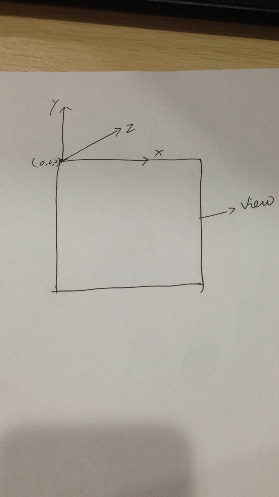
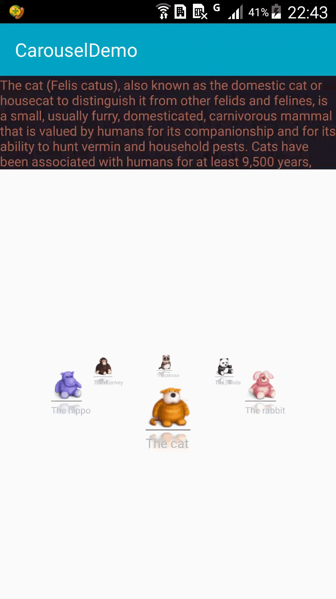
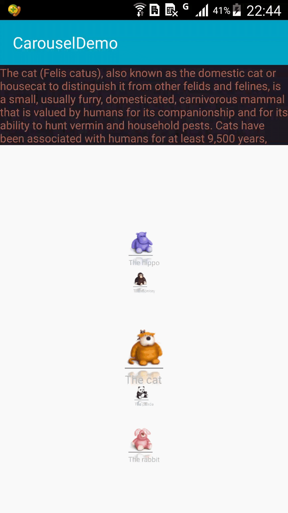
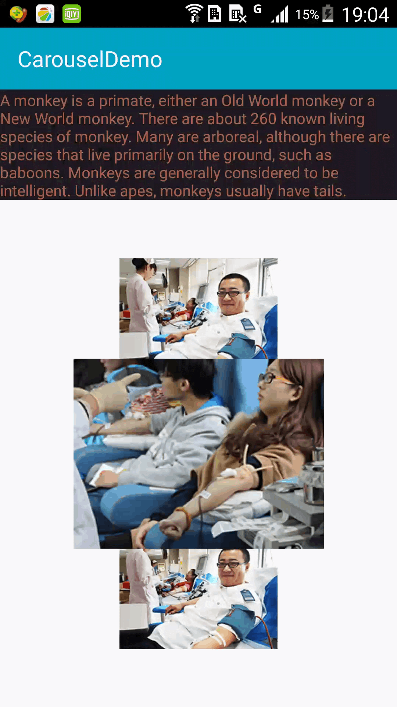

# Android-3D-Carousel
Android-3D-Carousel，3D滚动特效，参考网址：http://www.codeproject.com/Articles/146145/Android-3D-Carousel

# 坐标轴说明
在修改时候，主要是分清楚X，Y，Z轴，我试着将x，y，z分别为0，来区别清楚坐标轴。如下：



# 效果更改
在*Carousel.java*中有*Calculate3DPosition*方法，该方法主要给各个显示view进行定位，因为修改该方法就可以达到效果显示。*Calculate3DPosition(CarouselItem child, int diameter, float angleOffset)*中child是指显示的item view，diameter是手机屏幕宽度，angleOffset是角度。

修改如下：
## 水平圆形滚动特效
```java
/***
	 * 水平圆形滚动
	 * @param child
	 * @param diameter
	 * @param angleOffset
	 */
  private void Calculate3DPosition(CarouselItem child, int diameter, float angleOffset){
  	
  	angleOffset = angleOffset * (float)(Math.PI/180.0f);    	

  	float x = - (float)(diameter/2  * android.util.FloatMath.sin(angleOffset)) + diameter/2 - child.getWidth()/2;
  	float z = diameter/2 * (1.0f - (float)android.util.FloatMath.cos(angleOffset));
  	float y = - getHeight()/2 + (float) (z * android.util.FloatMath.sin(mTheta));
  	Log.i("item", "x:"+x+",y:"+y+",z:"+z);
  	child.setItemX(x);
  	child.setItemZ(z);
  	child.setItemY(y);
  }
```
效果如：



## 垂直滚动特效
```java
  /***
	 * 垂直滚动
	 * @param child
	 * @param diameter
	 * @param angleOffset
	 */
    private void Calculate3DPosition(CarouselItem child, int diameter, float angleOffset){
    	
    	angleOffset = angleOffset * (float)(Math.PI/180.0f);    	
    	int r=getHeight()/2;
    	//float x = - (float)(diameter/2  * android.util.FloatMath.sin(angleOffset)) + diameter/2 - child.getWidth()/2;
    	//float z = diameter/2 * (1.0f - (float)android.util.FloatMath.cos(angleOffset));
    	//float y = - getHeight()/2 + (float) (z * android.util.FloatMath.sin(mTheta));
    	float x = (float)diameter/2 - child.getWidth()/2;
    	float z = r-(float)(r* android.util.FloatMath.cos(angleOffset));
    	float y = - getHeight()/2+r* android.util.FloatMath.sin(angleOffset);
    	Log.i("item", "angleOffset:"+angleOffset+",diameter:"+diameter+",x:"+x+",y:"+y+",z:"+z);
    	child.setItemX(x);
    	child.setItemY(y);
    	child.setItemZ(z);
    }
```
效果如：




